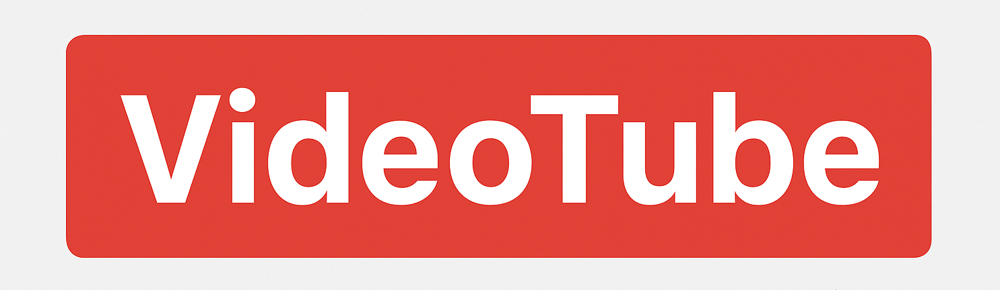

<!-- PROJECT LOGO & BANNER -->
<p align="center">
  
</p>

<h1 align="center">🎬 VideoTube - YouTube Clone (Backend)</h1>

<p align="center">
  <i>Learning backend development by building a YouTube Clone (VideoTube) from the Chai aur Code channel by Hitesh Choudhary Sir ☕</i>
</p>

---

## 🏷️ Badges

<p align="center">
  
  
  
  
  
</p>

## 🚀 Project Overview

VideoTube is a **YouTube clone backend** built from scratch.  
It covers everything from setting up a Node.js project to advanced backend topics like authentication, database modeling, file uploads, and API design.

This project is perfect for those who want to:
- Strengthen their backend fundamentals.
- Learn production-grade API design.
- Work with real-world use cases (videos, users, subscriptions, likes, etc.).

---

## 🧠 What I’m Learning

This project is part of my **backend development learning journey**, focusing on:

- Node.js and Express.js fundamentals  
- MongoDB with Mongoose (Schema design & relationships)  
- RESTful API design  
- JWT authentication & authorization  
- File handling and uploads (Multer / Cloudinary)  
- Environment variables and config management  
- Error handling and middlewares  
- MVC architecture and clean code structure  
- Deployment & environment setup

---

## 🧩 Tech Stack

| Category | Technology |
|-----------|-------------|
| **Runtime** | Node.js |
| **Framework** | Express.js |
| **Database** | MongoDB (Mongoose) |
| **Authentication** | JWT (JSON Web Token) |
| **File Uploads** | Multer / Cloudinary |
| **Environment Management** | dotenv |
| **Dev Tools** | Postman, Nodemon |


## ⚙️ Project Setup

```bash

1️⃣ Clone the Repository
git clone https://github.com/your-username/videotube-backend.git
cd videotube-backend

2️⃣ Install Dependencies:
npm install

3️⃣ Setup Environment Variables
Create a .env file in the root directory and add:

PORT=5000
MONGODB_URI=your_mongodb_connection_string
JWT_SECRET=your_secret_key
CLOUDINARY_API_KEY=your_key
CLOUDINARY_API_SECRET=your_secret
CLOUDINARY_CLOUD_NAME=your_name

4️⃣ Run the Server: 
npm run dev

Server will start on http://localhost:5000

```

## 🎥 Learning Source:

#### Instructor: Hitesh Choudhary
#### YouTube Channel: Chai aur Code
#### Series: Chai aur Backend - VideoTube (YouTube Clone)

This repository is built for educational purposes as part of learning backend development with Node.js and Express.js.

## 🧑‍💻 Author
### Vishal Jati
Learning Backend Development 🚀
📚 Following: Chai aur Code by Hitesh Choudhary Sir
📧 Contact: jativishal120@gmail.com
🌐 GitHub:[vishaljati](https://github.com/vishaljati)

## 📝 License
```This project is for learning and educational purposes only.Feel free to fork and experiment!


 